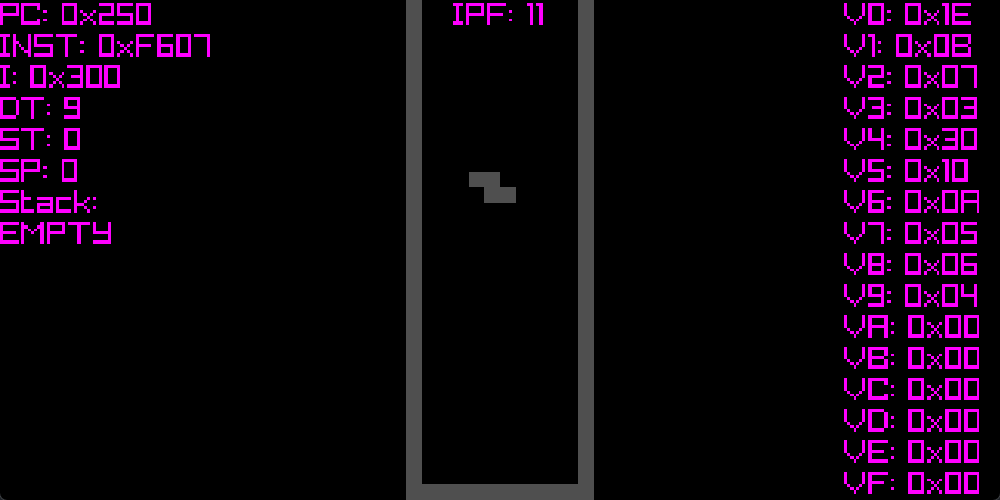

# chip8-odin
A cross-platform [CHIP-8](https://en.wikipedia.org/wiki/CHIP-8) interpreter/emulator written in [Odin](https://odin-lang.org/) using [raylib](https://www.raylib.com/). CHIP-8 is considered by many to be a good entry point into emulator development.


Space invaders


Tetris (debug display enabled)

## Build and run
Ensure Odin is [installed](https://odin-lang.org/docs/install/) and available on system PATH.

`roms/TETRIS` can be replaced with any CHIP-8 ROM path. A few test ROMs and games are included in this repository.

### Windows:
```
git clone https://github.com/oliverbaileysmith/chip8-odin.git
cd chip8-odin
odin build ./src -out:chip8.exe
chip8 roms/TETRIS
```
### Linux/macOS:
```
git clone https://github.com/oliverbaileysmith/chip8-odin.git
cd chip8-odin
odin build ./src -out:chip8
./chip8 roms/TETRIS
```

## Controls
I chose to implement the [COSMAC VIP](https://en.wikipedia.org/wiki/COSMAC_VIP) keypad layout at right, which I've mapped to the QWERTY keyboard at left:
```
QWERTY keyboard:        COSMAC VIP keypad:
1 2 3 4                 1 2 3 C
Q W E R                 4 5 6 D
A S D F                 7 8 9 E
Z X C V                 A 0 B F
```

Debug controls:
- `i` to toggle debug display
- `p` to toggle emulation pause
	 - `t` when paused to decrement delay and sound timers
	 - `space` when paused to advance program counter by one instruction
 - `[` to decrease instructions executed per frame
 - `]` to increase instructions executed per frame
 - `esc` to quit

## Resources:
- https://tobiasvl.github.io/blog/write-a-chip-8-emulator/
- http://devernay.free.fr/hacks/chip8/C8TECH10.HTM
